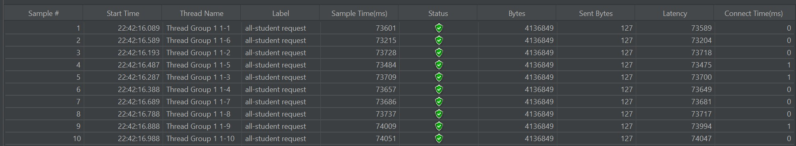
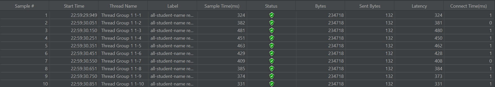
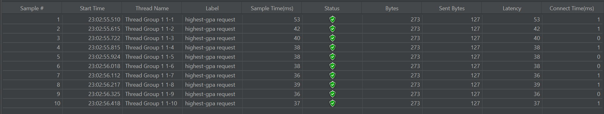

# Tutorial Modul 5

Reyhan Zada Virgiwibowo

2206081723

Advanced Programming - C

## Reflection

### Screenshots of performance testing table results with JMeter:

### `/all-student`

### `/all-student-name`

### `/highest-gpa`

