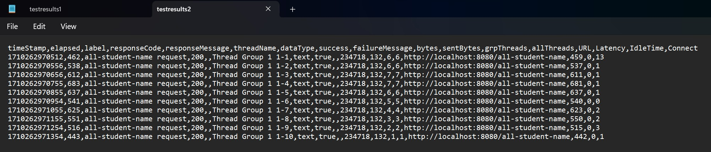
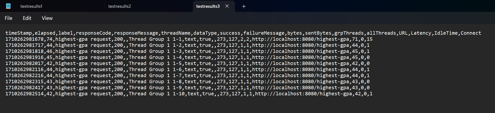
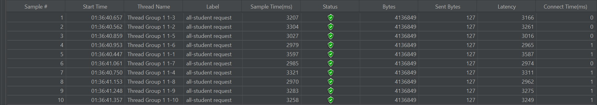
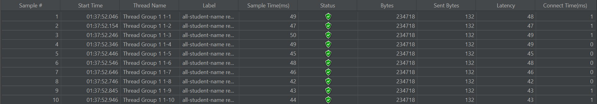
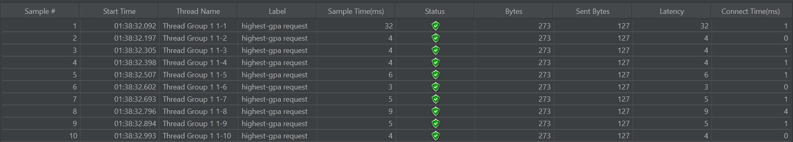

# Tutorial Modul 5

Reyhan Zada Virgiwibowo

2206081723

Advanced Programming - C

## Screenshots

### Screenshots of performance testing table results with JMeter:

### `/all-student`

### `/all-student-name`

### `/highest-gpa`

### Screenshots of performance testing results with JMeter using Command Line:

### `/all-student`

### `/all-student-name`

### `/highest-gpa`

### Screenshots of performance testing table results with JMeter after Optimization:

#### Conclusion : 

Setelah melalui proses profiling dan performance optimization, sample time dari tiap method menjadi jauh lebih cepat jika dibandingkan dengan sebelumnya. Dengan demikian, dapat disimpulkan bahwa saya telah berhasil melakukan optimisasi dan telah dibuktikan dengan bantuan JMeter.

### `/all-student`

### `/all-student-name`

### `/highest-gpa`

## Reflection

### 1.) Difference between performance testing with JMeter and profiling with IntelliJ Profiler

Pendekatan performance testing menggunakan JMeter dan profiling dengan IntelliJ Profiler memiliki pendekatan yang berbeda. 
Performance Testing dengan JMeter digunakan untuk menguji load testing dan stress testing pada aplikasi web, server FTP, dan database. Sementara itu, Profiling 
menggunakan IntelliJ Profiler digunakan untuk menganalisis performa aplikasi saat runtime termasuk memory usage dan CPU. Meskipun keduanya memiliki pendekatan yang berbeda, 
keduanya memiliki tujuan yang sama dalam mengoptimalkan kinerja dan performa aplikasi.

### 2.) Profiling Process in helping to identifying and understanding weak points

Pada proses profiling, saya mampu menemukan _bottleneck_ (titik lemah) pada aplikasi saya yang menyebabkan terjadinya penurunan performa.
Pada proses ini, IntelliJ Profiler menyajikan informasi-informasi penting mengenai performance seperti CPU usage, memory allocation, garbage collection activity,
dan thread concurrency. Informasi-informasi tersebut sangat bermanfaat untuk menganalisis bagian-bagian yang berpotensi menjadi _bottleneck_ pada aplikasi.

### 3.) Effectiveness of IntelliJ Profiler in assisting to analyze and identify bottlenecks

Menurut saya, IntelliJ Profiler dapat dikatakan cukup efektif untuk membantu saya menemukan bottleneck pada aplikasi saya. Beragam informasi yang diberikan oleh profiler
seperti flame graph, memberikan banyak insight mengenai performance dari aplikasi saya. Selain itu, setelah saya melakukan optimisasi pada sebuah method, profiler
memberikan informasi mengenai `Diff execution time` yaitu perubahan execution time dari sebelum optimisasi dan setelah optimisasi. Dengan adanya informasi tersebut, saya dapat
mengetahui seberapa impactful optimisasi yang telah saya lakukan.

### 4.) Challenges when conducting performance testing and profiling

Beberapa tantangan yang saya temukan saat melakukan performance testing dan profiling berawal dari tantangan untuk memahami hasil profiling. Pada awalnya, saya cukup kebingungan dalam membaca dan menganalisis informasi-informasi
yang muncul. Namun setelah membaca lebih detail dan teliti, saya menjadi paham dan dapat menemukan bottleneck yang mengganggu performance dari aplikasi saya. Setelah melakukan analisis terhadap
hasil profiling, saya juga menemukan tantangan saat melakukan optimisasi. Pada tahap optimisasi, saya harus melakukan refactoring pada bagian yang merupakan bottleneck dan proses ini cukup menantang bagi saya.

### 5.) Main benefits of using IntelliJ Profiler

Dengan melakukan Profiling menggunakan IntelliJ Profiler, saya dapat menemukan bugs, bottleneck, dan masalah performa dengan efisien. Dengan adanya bantuan sajian informasi seperti flame graph, proses untuk menemukan 
permasalahan performance dan melakukan optimisasi menjadi lebih mudah. Selain itu, salah satu manfaat dari menggunakan IntelliJ Profiler adalah saya tidak perlu menggunakan aplikasi third-party lainnya karena IntelliJ 
sudah menyediakan Profiler dalam IDE yang saya gunakan yaitu Intellij IDEA.

### 6.) Inconsistency between JMeter and IntelliJ Profiler

Sejauh ini, saya belum menemukan inkonsistensi antara hasil performance testing menggunakan JMeter dengan hasil Profiling menggunakan IntelliJ Profiler. Namun, jika kedepannya saya mengalami hal tersebut, 
saya akan memastikan terlebih dahulu apakah konfigurasi kedua tools tersebut sudah benar atau tidak. Setelah memastikan konfigurasi sudah benar, saya akan melakukan uji ulang dan memastikan skenario pengujian
sudah dibuat dengan akurat. Jika masih terdapat perbedaan, kemungkinan besar saya akan mencari solusi melalui bantuan di internet seperti StackOverflow, Youtube, atau bertanya kepada teman, asdos, dan dosen.

### 7.) Strategies in optimizing application code

Berikut adalah beberapa strategi yang saya implementasikan untuk mengoptimalkan performa aplikasi saya :

- **Melakukan profiling** untuk menemukan bagian kode yang merupakan bottleneck dan memakan waktu dan memori yang terbanyak. 

- **Menganalisis dan mencari solusi algoritma yang lebih efisien** pada bagian kode yang merupakan bottleneck. Contohnya, pada method `joinStudentNames()`, 
saya mengubah operasi concatenation pada string yang awalnya menggunakan for loop, saya ubah menggunakan stream dan operasi map-reduce.

- **Mengurangi jumlah pemanggilan database**, seperti misalnya pada method `getAllStudentWithCourses()` yang awalnya memanggil database
untuk mengakses daftar mahasiswa, saya refactor dengan menggunakan `studentCourseRepository.findAll()` untuk mengakses seluruh mahasiswa dan disimpan kedalam `HashMap`
untuk mempermudah pengaksesan mahasiswa tanpa perlu melakukan pemanggilan database lagi.

- **Mengoptimalkan proses query**, contohnya pada method `findStudentWithHighestGpa()`, yang sebelumnya mengiterasi semua mahasiswa dan mengcompare IPK satu per satu, saya optimalkan dengan menggunakan query yang mengurutkan mahasiswa
dari IPK tertinggi ke terendah sehingga saya dapat mengambil mahasiswa yang berada pada posisi pertama untuk mendapatkan mahasiswa dengan IPK tertinggi.

Setelah melakukan tahap-tahap optimisasi tersebut, saya memastikan fungsionaitas aplikasi tidak berubah. Kemudian, saya menjalankan kembali performance testing dan saya membandingkan kembali
hasil performance testing setelah optimisasi dan sebelum optimisasi.
