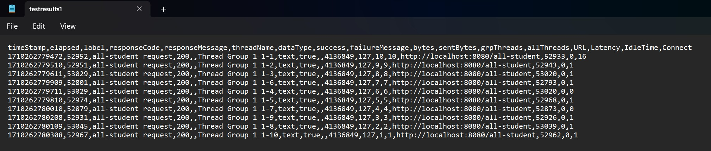

# Tutorial Modul 5

Reyhan Zada Virgiwibowo

2206081723

Advanced Programming - C

## Screenshots

### Screenshots of performance testing table results with JMeter:

### `/all-student`

### `/all-student-name`

### `/highest-gpa`

### Screenshots of performance testing results with JMeter using Command Line:

### `/all-student`

### `/all-student-name`

### `/highest-gpa`

### Screenshots of performance testing table results with JMeter after Optimization:

#### Conclusion : 

Setelah melalui proses profiling dan performance optimization, sample time dari tiap method menjadi jauh lebih cepat jika dibandingkan dengan sebelumnya. Dengan demikian, dapat disimpulkan bahwa saya telah berhasil melakukan optimisasi dan telah dibuktikan dengan bantuan JMeter.

### `/all-student`

### `/all-student-name`

### `/highest-gpa`

